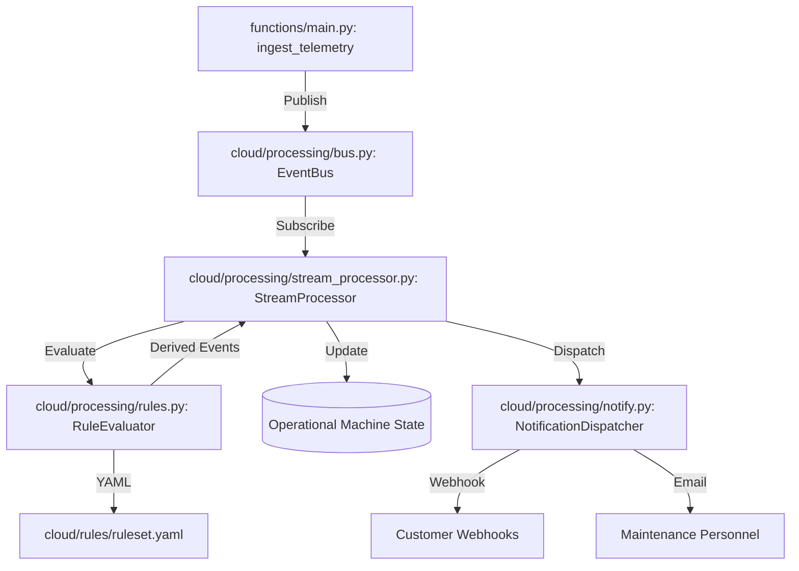

# Cloud Hot-Path Processing Architecture

The Hot-Path Processing layer provides sub-second machine state updates and rule-based alerting for the SIMCO AI platform.

## Architecture



## Rule Format

Rules are defined in `cloud/rules/ruleset.yaml`. Supported types:

### Threshold Rule
Triggers when a metric exceeds or falls below a value.
```yaml
- id: RULE_ID
  name: "Description"
  type: "threshold"
  metric: "metric_name"
  operator: ">" # or "<"
  value: 90.0
  severity: "HIGH"
  event_type: "ANOMALY_DETECTED"
```

### State Change Rule
Triggers when a machine transitions between specific statuses.
```yaml
- id: RULE_ID
  name: "Description"
  type: "state_change"
  from: "RUNNING"
  to: "STOPPED"
  severity: "MEDIUM"
  event_type: "STATE_ALARM"
```

## Idempotency
Derived events are assigned a deterministic `event_id` based on:
`sha256(tenant : site : machine : rule_id : record_timestamp)`

This ensures that even if a telemetry record is processed twice, only one alert and one notification are generated.
